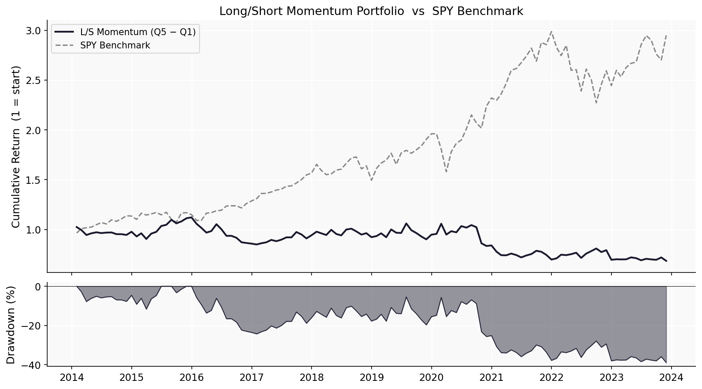
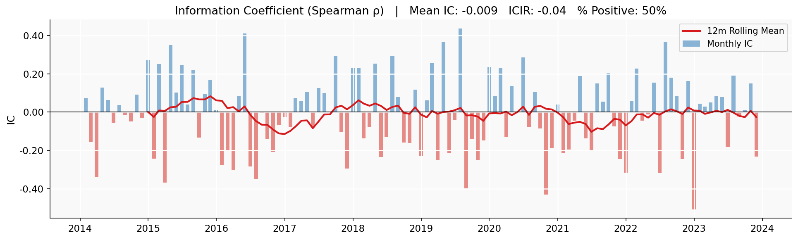
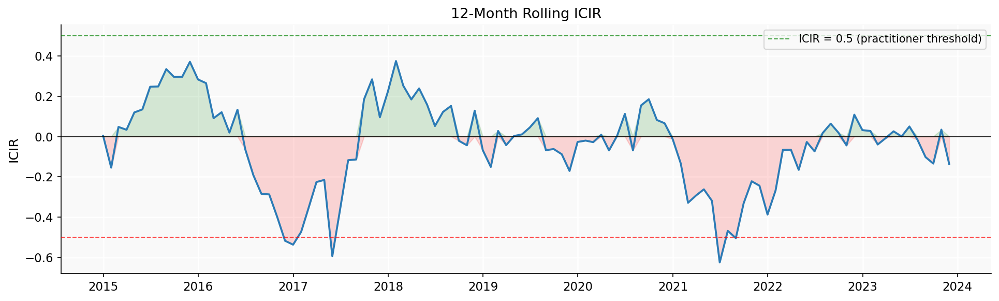
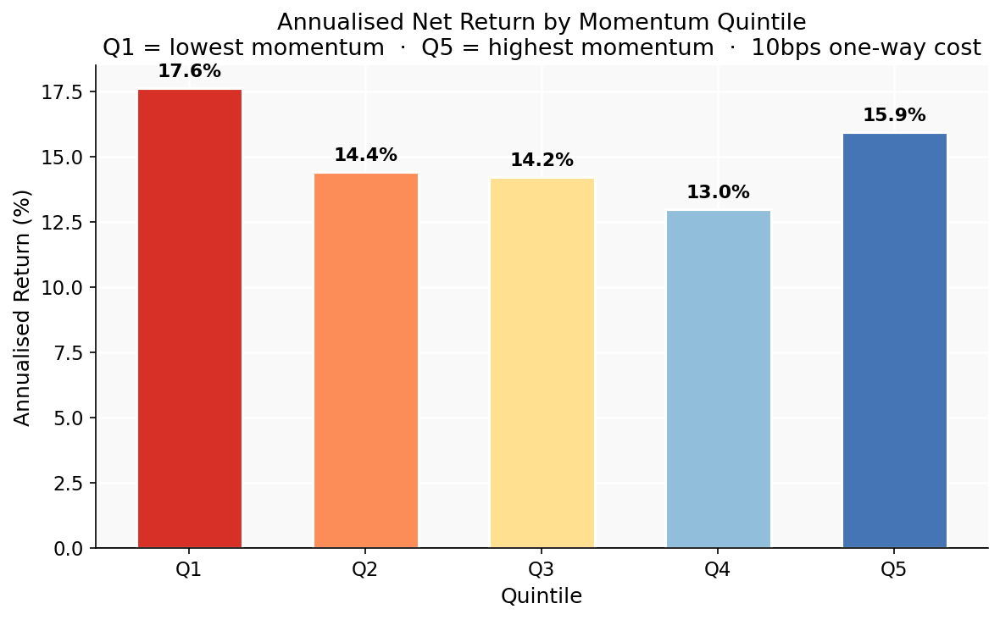

# Cross-Sectional Momentum: An Alpha Signal Study

> Evaluating 12-1 month price momentum across S&P 500 equities using the Information Coefficient framework standard at systematic equity funds. The signal shows near-zero predictive power over 2013–2024 — a finding that is honest, explainable, and more instructive than a cherry-picked result.



---

## Why It Matters

Momentum — the tendency of recent winners to continue outperforming recent losers — is one of the most replicated findings in empirical asset pricing and one of the most widely deployed signals at systematic funds. Understanding *how to evaluate* a signal rigorously, not just how to run a backtest, is the core skill demonstrated here.

The evaluation uses the **Information Coefficient (IC)** framework: the cross-sectional Spearman rank correlation between signal and subsequent returns at each rebalancing date. This is the standard diagnostic tool for signal research at quantitative funds, distinct from the strategy-level Sharpe ratio that dominates retail backtests.

---

## Methodology

- **Universe:** Current S&P 500 constituents (~487 stocks after quality filtering)
- **Signal:** 12-1 month momentum — cumulative return from *t-12* to *t-1*, skipping the most recent month to avoid short-term reversal contamination
- **Evaluation:** Monthly IC (Spearman rank correlation), ICIR = Mean IC / Std IC
- **Portfolio construction:** Equal-weighted quintile portfolios, monthly rebalancing
- **Transaction costs:** 10bps one-way applied to monthly turnover
- **Benchmark:** SPY (S&P 500 ETF)
- **Period:** 2013–2024 (119 months)

---

## Key Results

### IC Analysis



| Metric | Value |
|---|---|
| Mean IC | -0.009 |
| Std IC | 0.200 |
| ICIR | -0.044 |
| % Positive IC | 49.6% |
| Observations | 119 months |

The IC is statistically indistinguishable from zero (ICIR ≈ 0, hit rate ≈ coin flip). The signal had no reliable cross-sectional predictive power over this period.



### Quintile Returns



| Quintile | Ann. Return |
|---|---|
| Q1 (Losers) | 17.6% |
| Q2 | 14.4% |
| Q3 | 14.2% |
| Q4 | 13.0% |
| Q5 (Winners) | 15.9% |
| **Q5 − Q1 spread** | **−1.7%** |

The quintile pattern is inverted: past losers (Q1) outperformed past winners (Q5) by 1.7% annually. This is a mean-reversion, not a momentum, regime.

### Long/Short Portfolio Performance

| Strategy | Ann. Return | Sharpe | Max Drawdown |
|---|---|---|---|
| L/S Momentum | -3.7% | -0.26 | -38.9% |
| SPY Benchmark | +11.5% | 0.76 | -23.9% |
| Q5 Long Leg | +15.9% | 1.00 | -19.2% |
| Q1 Short Leg | +17.6% | 0.78 | -32.2% |

The long leg (Q5) actually performed well in isolation (+15.9%, Sharpe 1.00), but the short leg (Q1) outperformed it, producing a negative L/S spread.

---

## Why Momentum Struggled in This Period

This result is consistent with documented momentum underperformance post-2013. Three specific episodes drove it:

**1. 2020 COVID crash and recovery** — Momentum strategies suffered their worst drawdown in decades. Stocks with strong prior performance sold off sharply in March 2020, then underperformed during the V-shaped recovery as beaten-down names rallied hardest. This is a classic momentum crash: the reversal of an extended trend causes simultaneous losses on both legs.

**2. 2022 rate shock** — Rising rates hit high-multiple growth stocks disproportionately. These names had been momentum winners during the low-rate era; when the regime shifted, they became underperformers.

**3. S&P 500 universe** — The original Jegadeesh & Titman (1993) evidence was on a broader universe including small-caps. Within the S&P 500, momentum effects are weaker because large-cap stocks are more efficiently priced and subject to higher institutional crowding.

This does not invalidate momentum as a factor. It illustrates that factor returns are time-varying and regime-dependent — a nuance that practitioners are well aware of but that backtests often obscure.

---

## How to Run

```bash
pip install -r requirements.txt
jupyter lab
```

Open `report.ipynb` and select the **Quant Portfolio** kernel. Prices are cached after the first download (~2–3 minutes for 487 stocks). Subsequent runs load from cache instantly.

---

## Limitations

1. **Survivorship bias** — current constituent list excludes delisted and removed companies; correcting this requires a historical point-in-time database (CRSP/Compustat)
2. **Universe scope** — S&P 500 large-caps only; momentum evidence is stronger in broader universes including small- and mid-caps
3. **Flat transaction cost model** — 10bps one-way is a reasonable estimate for liquid large-caps at modest AUM; real costs depend on position size and market impact
4. **Short book practicalities** — borrow costs and hard-to-borrow names not modelled; Q1 short leg would be more expensive to implement than the gross return implies
5. **Momentum crashes** — sharp drawdowns following trend reversals (2020, 2022) are a real and non-diversifiable tail risk of the strategy

## Next Steps

- **Regime conditioning:** Reduce momentum exposure following high-volatility or sharp drawdown environments where crashes are most likely
- **Volatility scaling:** Size positions inversely to realised volatility to dampen crash severity
- **Broader universe:** Test on Russell 1000 or Russell 3000 to capture the mid- and small-cap momentum premium
- **Signal combination:** Combine with value or quality to partially offset momentum crash exposure (Asness et al., 2013)
- **Sector neutralisation:** Rank stocks relative to sector peers to isolate stock-level momentum from sector-level effects
